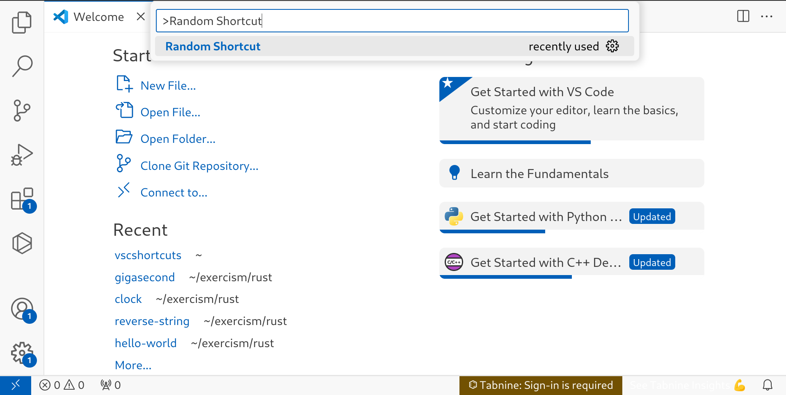

# vscshortcuts README

## Description

**vscshortcuts** is a Visual Studio Code extension that enhances your coding experience by displaying useful keyboard shortcuts right when you start VS Code and when you type in the search bar. Whether you're a seasoned developer or just getting started, this extension helps you streamline your workflow and discover new shortcuts to boost your productivity.

## Features

- **Random Shortcut on Startup**: Every time you open VS Code, a random keyboard shortcut will be displayed to help you learn and remember useful commands.
  
- **Random Shortcut on search**: Type in the search bar _Random_ Shortcut to get a random shortcut.

## Requirements

- Visual Studio Code 1.50.0 or later.

## Extension Settings
 - there is no settings right now for vsc shortcuts
## Known Issues

- Occasionally, the random shortcut displayed on startup may not be fully relevant to your current context.

## Release Notes

### 1.0.0

- Initial release of **vscshortcuts** with features for displaying random shortcuts on startup and enabling shortcut search.

---

**Enjoy coding with vscshortcuts!**
